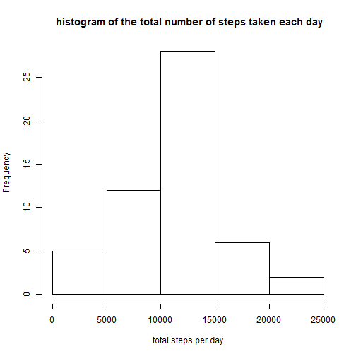
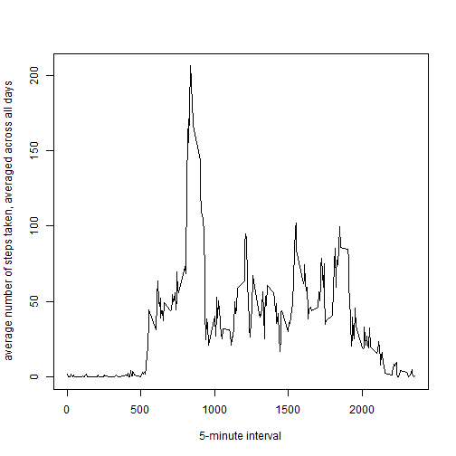
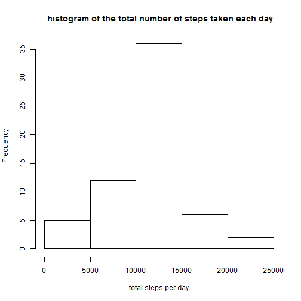

## Loading and preprocessing the data

Loading the data and converting date column to date format

```r
    act=read.csv("activity.csv")
    act$date=as.Date(act$date)
```


## What is mean total number of steps taken per day?

Calculting the steps taken per day then storing them into spd

creating a hist for total number of steps taken each day

```r
spd=aggregate(act$steps,list(act$date),sum)
spd=na.omit(spd)
hist(spd[,2],xlab="total steps per day",main=" histogram of the total number of steps taken each day")
```

 


Calculating the mean and median

```r
spdmn=mean(spd[,2],na.rm=TRUE)
spdmd=median(spd[,2],na.rm=TRUE)
```
**The mean=1.0766 &times; 10<sup>4</sup> and the median =10765**


## What is the average daily activity pattern?

creating a  time series plot (i.e. type = "l") of the 5-minute interval (x-axis) and the average number of steps taken, averaged across all days (y-axis)

```r
spi=aggregate(steps~interval,act,mean, na.action = na.omit)
plot(spi[,1],spi[,2],type="l",xlab="5-minute interval",ylab="average number of steps taken, averaged across all days")
```

 

calculating the interval with max number of steps

```r
maxstep=spi[which.max(spi[,2]),1]
```

**The 5-minute interval, on average across all the days in the dataset, contains** **the maximum number of steps =835**
 
 
 
 
## Imputing missing values

calculating the total number of missing values

```r
mv=nrow(act)-nrow(na.omit(act))
```
**total number of missing values in the dataset=2304**

filling in all the missing values of the dataset with the mean for that 5-minute interval and filling in the new data set

```r
nact=act
for(i in 1:nrow(nact)){
    nact[i,1]=ifelse(is.na(nact[i,1]),spi[spi$interval==nact[i,3],2],nact[i,1])
    }
```

**new dataset created is called nact which has no missing values**

making a histogram of the total number of steps taken each day

```r
nspd=aggregate(nact$steps,list(nact$date),sum)
hist(nspd[,2],xlab="total steps per day",main=" histogram of the total number of steps taken each day")
```

 

Calculating the new mean and median

```r
nspdmn=mean(nspd[,2])
nspdmd=median(nspd[,2])
```
**The new mean=1.0766 &times; 10<sup>4</sup> and the median =1.0766 &times; 10<sup>4</sup>**

**The original mean=1.0766 &times; 10<sup>4</sup> and the median =10765**

**So We can see a shift in median but not the mean this is because of the method used to replace the na**


**imputing data removes the bias caused by the missing dataset**

## Are there differences in activity patterns between weekdays and weekends?

creating a new column represting a weekday or weekend

```r
nact$de=ifelse((weekdays(nact$date)=="Sunday"),"weekend","weekday")
nact$de=ifelse((weekdays(nact$date)=="Saturday"),"weekend",nact$de)
nact$de=as.factor(nact$de)
```


Creating the plot

```r
library(lattice)
y=split(nact,nact$de)
spiwd=aggregate(y[[1]]$steps,list(y[[1]]$interval),mean)
spiwe=aggregate(y[[2]]$steps,list(y[[2]]$interval),mean)
spiwd$day="Weekday"
spiwe$day="Weekend"
spic=rbind(spiwd,spiwe)
xyplot(spic[,2]~spic[,1]|spic$day,type="l",layout=c(1,2),xlab="Interval",ylab="Number of steps")
```

 
